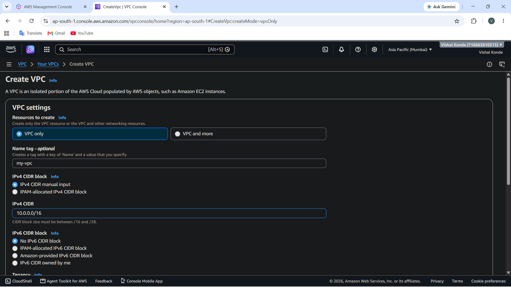
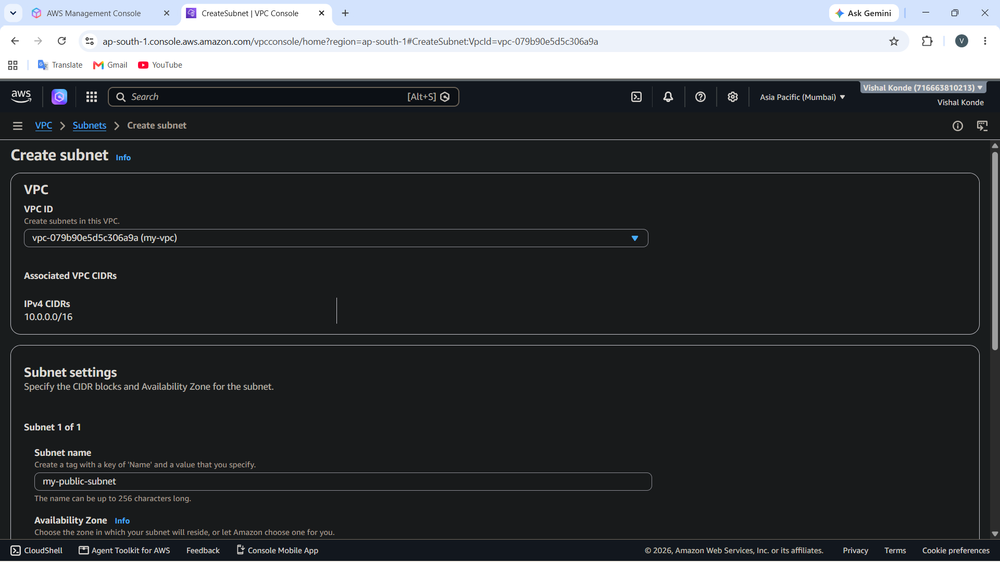
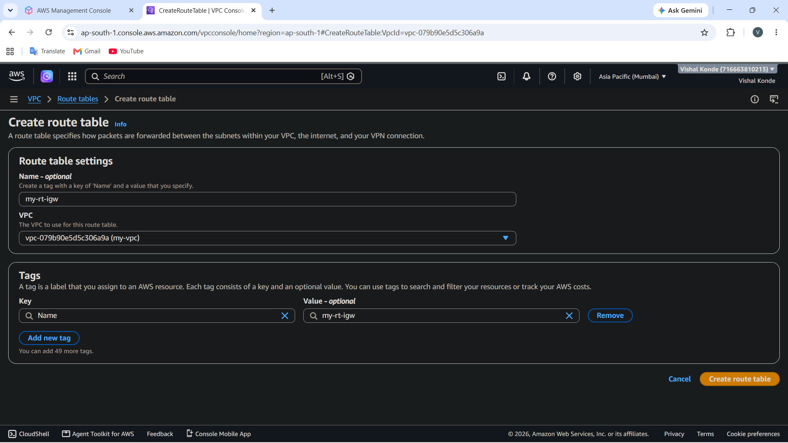
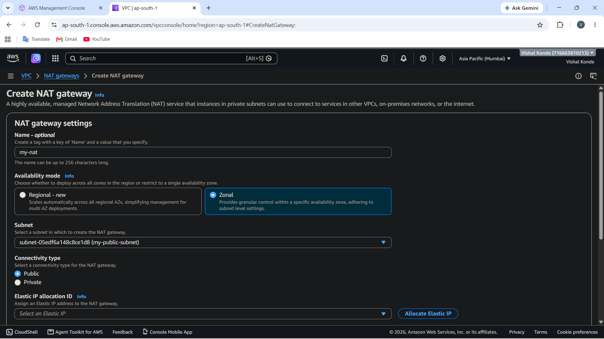
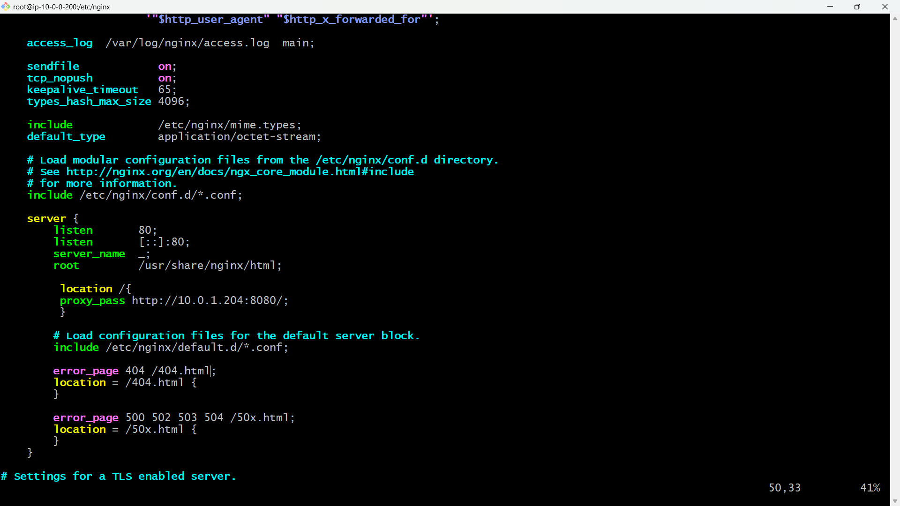
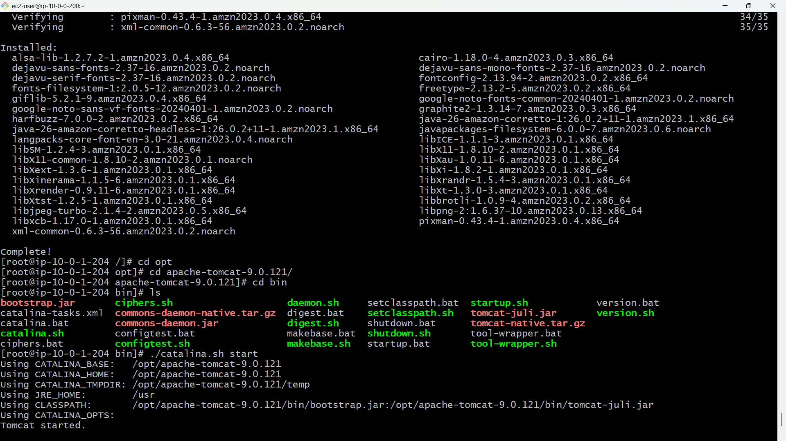
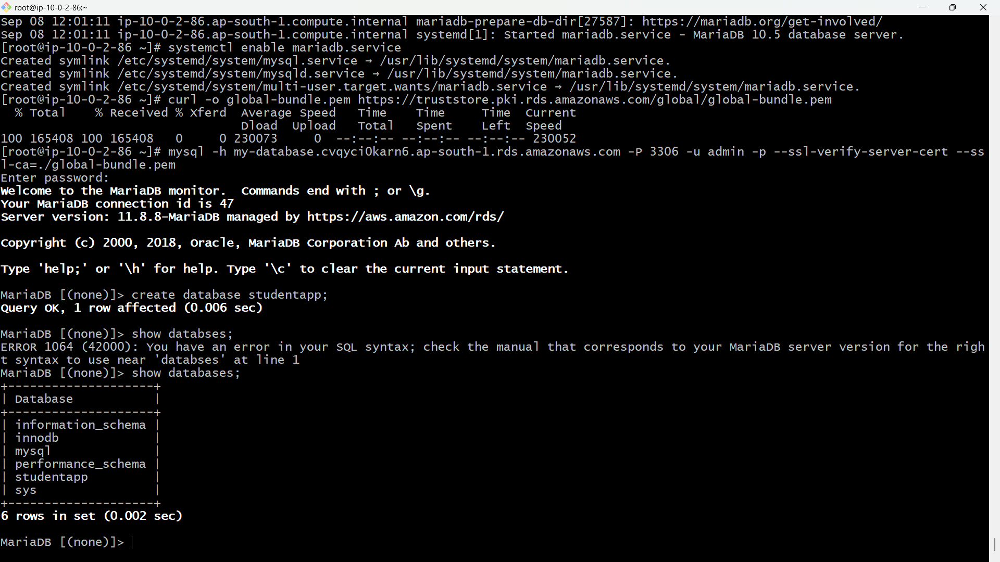
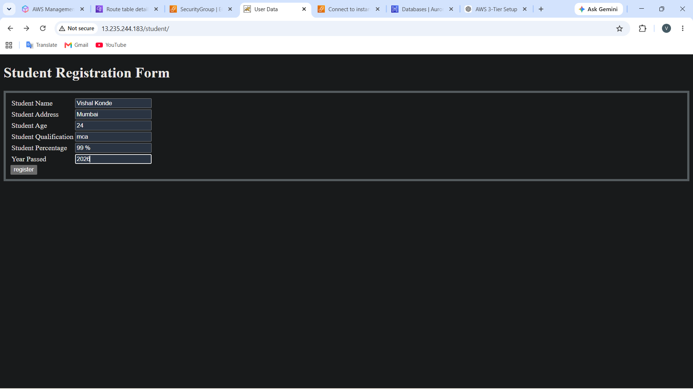
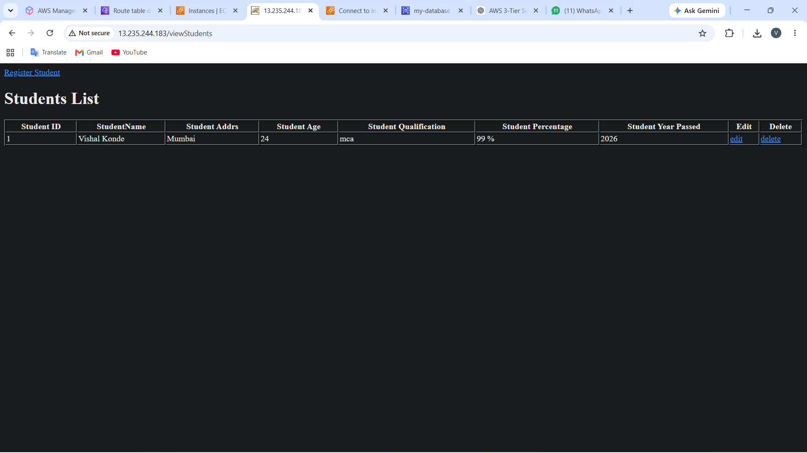

# AWS 3-Tier Web Application Deployment


## 📌 Project Overview

This project demonstrates the deployment of a Java-based **Student Registration Web Application** using a **three-tier architecture on AWS**.

The application is divided into three layers:

- **Web Tier** – Nginx
- **Application Tier** – Apache Tomcat + Java Web Application
- **Database Tier** – Amazon RDS MySQL

Nginx receives requests from users and forwards them to the application server. Apache Tomcat hosts the Java WAR application, which processes student registration requests and stores the submitted records in Amazon RDS MySQL.

---

## 🎯 Project Goal

The goal of this project is to design and deploy a three-tier Java web application on AWS by separating the **web, application, and database layers**.

The project demonstrates how AWS networking, EC2, Nginx, Apache Tomcat, Security Groups, and Amazon RDS can be integrated to deploy a functional web application.

---

## 🎯 Project Objectives

- Deploy a Java-based Student Registration Application on AWS
- Create and configure an AWS VPC
- Create public and private subnets
- Configure Internet Gateway and NAT Gateway
- Deploy a public-facing Nginx server
- Configure Nginx as a reverse proxy
- Deploy the Java WAR application on Apache Tomcat
- Configure communication between Nginx and Tomcat
- Create an Amazon RDS MySQL database
- Connect the Java application to RDS using JDBC and JNDI DataSource
- Configure Security Groups for communication between the three tiers
- Store student registration records in the database
- Test end-to-end communication between the web, application, and database layers

---

# 🏗️ Architecture

```text
                         INTERNET
                             |
                             | HTTP : 80
                             v
                  +-----------------------+
                  |       WEB TIER        |
                  |       Amazon EC2      |
                  |        Nginx          |
                  |     Public Subnet    |
                  |        Port 80        |
                  +-----------+-----------+
                              |
                              | HTTP : 8080
                              v
                  +-----------------------+
                  |   APPLICATION TIER    |
                  |       Amazon EC2      |
                  |    Apache Tomcat 9    |
                  |      Java WAR App     |
                  |    Private Subnet     |
                  |       Port 8080       |
                  +-----------+-----------+
                              |
                              | MySQL : 3306
                              v
                  +-----------------------+
                  |     DATABASE TIER     |
                  |       Amazon RDS      |
                  |        MySQL          |
                  |    Private Subnet     |
                  |       Port 3306       |
                  +-----------------------+
```

### Request Flow

```text
User
  |
  v
Nginx :80
  |
  v
Apache Tomcat :8080
  |
  v
Java Student Application
  |
  v
Amazon RDS MySQL :3306
  |
  v
Student Records
```

---

# ☁️ AWS Services Used

| AWS Service | Purpose |
|---|---|
| **Amazon VPC** | Provides the isolated network environment |
| **Amazon EC2** | Hosts Nginx and Apache Tomcat |
| **Amazon RDS** | Hosts the MySQL database |
| **Internet Gateway** | Provides internet connectivity to the public subnet |
| **NAT Gateway** | Provides outbound internet access for private resources |
| **Security Groups** | Controls traffic between application layers |
| **Route Tables** | Controls network traffic routing |
| **Elastic IP** | Provides a static IP for the NAT Gateway |

---

# 🌐 Network Configuration

## VPC

```text
VPC CIDR: 10.0.0.0/16
```

## Subnets

| Subnet | CIDR | Availability Zone | Purpose |
|---|---|---|---|
| Public Subnet | `10.0.0.0/24` | `ap-south-1a` | Nginx / Jump Server |
| Private Subnet-01 | `10.0.1.0/24` | `ap-south-1b` | Application Server |
| Private Subnet-02 | `10.0.2.0/24` | `ap-south-1c` | Database Layer |

---

# 🔐 Security Group Configuration

## Web / Jump Server Security Group

### Inbound Rules

| Protocol | Port | Source |
|---|---:|---|
| TCP | 80 | `0.0.0.0/0` |
| TCP | 22 | Your IP |

## Application Server Security Group

### Inbound Rules

| Protocol | Port | Source |
|---|---:|---|
| TCP | 8080 | Web / Jump Server Security Group |
| TCP | 22 | Web / Jump Server Security Group |

## Database Security Group

### Inbound Rules

| Protocol | Port | Source |
|---|---:|---|
| TCP | 3306 | Application Server Security Group |

---

# 🚀 Implementation

## 1. Create VPC

Create a VPC using:

```text
CIDR: 10.0.0.0/16
```

## 2. Create Subnets

Create the following subnets:

```text
Public Subnet
10.0.0.0/24

Private Subnet-01
10.0.1.0/24

Private Subnet-02
10.0.2.0/24
```

## 3. Create Internet Gateway

Create an Internet Gateway and attach it to the VPC.

Configure the public route table:

```text
Destination: 0.0.0.0/0
Target: Internet Gateway
```

Associate the public subnet with the public route table.

## 4. Create NAT Gateway

Create a NAT Gateway inside the public subnet.

Associate an Elastic IP with the NAT Gateway.

Configure the private route table:

```text
Destination: 0.0.0.0/0
Target: NAT Gateway
```

Associate the private subnets with the private route table.

---

# 🖥️ Web Tier – Nginx

## 5. Create Web / Jump Server

Launch an EC2 instance inside the public subnet.

Example:

```text
Name: Jump-server
Subnet: Public Subnet
Security Group: Web Security Group
Port: 80
```

## 6. Install Nginx

```bash
sudo yum install nginx -y
```

Start Nginx:

```bash
sudo systemctl start nginx
```

Enable Nginx:

```bash
sudo systemctl enable nginx
```

Check status:

```bash
sudo systemctl status nginx
```

---

# ⚙️ Nginx Reverse Proxy

Nginx configuration file:

```text
/etc/nginx/nginx.conf
```

Example configuration:

```nginx
server {
    listen 80;
    server_name _;

    location / {
        proxy_pass http://APPLICATION_PRIVATE_IP:8080;

        proxy_set_header Host $host;
        proxy_set_header X-Real-IP $remote_addr;
        proxy_set_header X-Forwarded-For $proxy_add_x_forwarded_for;
        proxy_set_header X-Forwarded-Proto $scheme;
    }
}
```

Replace:

```text
APPLICATION_PRIVATE_IP
```

with the private IP address of the application server.

Test:

```bash
sudo nginx -t
```

Restart:

```bash
sudo systemctl restart nginx
```

---

# ☕ Application Tier – Apache Tomcat

## 7. Create Application Server

Launch an EC2 instance inside the private subnet.

Example:

```text
Name: Application-server
Subnet: Private Subnet-01
Security Group: Application Security Group
Port: 8080
```

## 8. Install Java

```bash
sudo yum install java -y
```

Verify:

```bash
java --version
```

---

# 🐱 9. Install Apache Tomcat

Download Apache Tomcat 9 and extract it into `/opt`.

```bash
sudo tar -xvzf apache-tomcat-9.x.x.tar.gz -C /opt
```

Navigate to Tomcat:

```bash
cd /opt/apache-tomcat-9.x.x
```

Go to the `bin` directory:

```bash
cd bin
```

Start Tomcat:

```bash
./catalina.sh start
```

Verify:

```bash
ps -ef | grep tomcat
```

Check port:

```bash
sudo ss -lntp | grep 8080
```

Tomcat runs on:

```text
Port: 8080
```

---

# 📦 10. Deploy Student Application

Navigate to the Tomcat `webapps` directory:

```bash
cd /opt/apache-tomcat-9.x.x/webapps
```

Download the Student Registration WAR file:

```bash
curl -O <STUDENT_WAR_DOWNLOAD_URL>
```

The application file:

```text
student.war
```

Tomcat automatically deploys the WAR application.

Direct application URL:

```text
http://APPLICATION_IP:8080/student
```

---

# 🗄️ Database Tier – Amazon RDS

## 11. Create Amazon RDS Database

Create an Amazon RDS MySQL database.

Example:

```text
Database Engine: MySQL
Database Name: studentapp
Port: 3306
Username: admin
```

Configure the RDS instance in the appropriate private subnets.

---

# 🛢️ 12. Connect to RDS

Connect using:

```bash
mysql -h <RDS-ENDPOINT> -u admin -p
```

Enter the database password when prompted.

---

# 📋 13. Create Database

```sql
CREATE DATABASE studentapp;
```

Select the database:

```sql
USE studentapp;
```

---

# 📑 14. Create Students Table

```sql
CREATE TABLE IF NOT EXISTS students (
    student_id INT NOT NULL AUTO_INCREMENT,
    student_name VARCHAR(100) NOT NULL,
    student_addr VARCHAR(100) NOT NULL,
    student_age VARCHAR(3) NOT NULL,
    student_qual VARCHAR(20) NOT NULL,
    student_percent VARCHAR(10) NOT NULL,
    student_year_passed VARCHAR(10) NOT NULL,
    PRIMARY KEY (student_id)
);
```

---

# 🔌 15. Install MySQL JDBC Connector

Navigate to the Tomcat library directory:

```bash
cd /opt/apache-tomcat-9.x.x/lib
```

Place the MySQL JDBC connector in this directory:

```text
mysql-connector.jar
```

The connector allows the Java application to communicate with MySQL.

---

# 🔗 16. Configure JNDI DataSource

Edit:

```text
/opt/apache-tomcat-9.x.x/conf/context.xml
```

Add the following DataSource configuration inside the `<Context>` element:

```xml
<Resource
    name="jdbc/TestDB"
    auth="Container"
    type="javax.sql.DataSource"
    maxTotal="500"
    maxIdle="30"
    maxWaitMillis="1000"
    username="YOUR_DB_USERNAME"
    password="YOUR_DB_PASSWORD"
    driverClassName="com.mysql.jdbc.Driver"
    url="jdbc:mysql://YOUR_RDS_ENDPOINT:3306/studentapp?useUnicode=yes&amp;characterEncoding=utf8"
/>
```

Replace:

```text
YOUR_DB_USERNAME
YOUR_DB_PASSWORD
YOUR_RDS_ENDPOINT
```

with your actual database configuration.

> **Never commit real database credentials to GitHub.**

---

# 🔄 17. Restart Tomcat

Stop Tomcat:

```bash
cd /opt/apache-tomcat-9.x.x/bin
./catalina.sh stop
```

Start Tomcat:

```bash
./catalina.sh start
```

---

# 🌍 18. Access Application Through Nginx

Open the public IP address of the Web / Jump Server:

```text
http://PUBLIC_IP/student
```

The complete request flow is:

```text
Browser
   |
   v
Nginx :80
   |
   v
Tomcat :8080
   |
   v
Java Web Application
   |
   v
RDS MySQL :3306
```

---

# 📝 Student Registration

The application provides a Student Registration Form.

### Form Fields

- Student Name
- Student Address
- Student Age
- Student Qualification
- Student Percentage
- Year Passed

After submitting the form, the Java application processes the request and stores the student information in the MySQL database.

---

# 🧪 Testing

## Test Nginx

```bash
sudo systemctl status nginx
```

## Test Tomcat

```bash
ps -ef | grep tomcat
```

## Test Tomcat Port

```bash
sudo ss -lntp | grep 8080
```

## Test RDS Connection

```bash
mysql -h <RDS-ENDPOINT> -u admin -p
```

## Check Database Records

```sql
USE studentapp;

SELECT * FROM students;
```

---

# 🔍 Troubleshooting

## Nginx 502 / 504 Error

Check Nginx logs:

```bash
sudo tail -f /var/log/nginx/error.log
```

Test connectivity from Nginx to Tomcat:

```bash
curl http://APPLICATION_PRIVATE_IP:8080
```

## Tomcat Application Error

Check Tomcat logs:

```bash
tail -f /opt/apache-tomcat-9.x.x/logs/catalina.out
```

## Database Connection Error

Test:

```bash
mysql -h <RDS-ENDPOINT> -u admin -p
```

Check:

- RDS endpoint
- Database name
- Username
- Password
- Port `3306`
- RDS Security Group
- Application Server Security Group
- VPC configuration
- Route tables

---

# 📸 Screenshots

Store project screenshots inside the `screenshots` directory.

### AWS VPC



### Subnets



### Route Table



### NAT Gateway



### Nginx



### Apache Tomcat



### Amazon RDS



### Student Registration Form



### Database Records



---

# 📁 Repository Structure

```text
aws-3-tier-web-application/
│
├── README.md
│
├── architecture/
│   └── architecture-diagram.png
│
├── screenshots/
│   ├── vpc.png
│   ├── subnets.png
│   ├── route-table.png
│   ├── nat-gateway.png
│   ├── nginx.png
│   ├── tomcat.png
│   ├── rds.png
│   ├── registration-form.png
│   └── database-record.png
│
├── nginx/
│   └── nginx.conf
│
├── tomcat/
│   └── context.xml
│
├── database/
│   └── schema.sql
│
└── documentation/
    └── AWS-3-Tier-Web-Application-Deployment.pdf
```

---

# 🔐 Security Notes

Never upload sensitive information to GitHub.

Do **not** commit:

```text
*.pem
*.ppk
.env
AWS credentials
AWS access keys
AWS secret keys
Database passwords
Private keys
```

Use placeholders:

```text
YOUR_RDS_ENDPOINT
YOUR_DB_USERNAME
YOUR_DB_PASSWORD
APPLICATION_PRIVATE_IP
```

---

# 🛠️ Technologies Used

## Cloud

- Amazon Web Services
- Amazon VPC
- Amazon EC2
- Amazon RDS

## Web Server

- Nginx

## Application Server

- Apache Tomcat
- Java
- WAR Application

## Database

- MySQL
- JDBC
- JNDI DataSource

## Operating System

- Linux

## Tools

- Git
- GitHub
- SSH
- MySQL Client

---

# 📚 Key Learning Outcomes

- AWS VPC networking
- Public and private subnets
- Route tables
- Internet Gateway
- NAT Gateway
- EC2 deployment
- Nginx reverse proxy
- Apache Tomcat deployment
- Java WAR deployment
- RDS database connectivity
- JDBC
- JNDI DataSource
- Security Groups
- Three-tier architecture
- Linux server administration
- Application troubleshooting
- Database connectivity

---

# ✅ Project Result

The Student Registration Web Application was successfully deployed using a three-tier architecture on AWS.

The final architecture separates:

1. **Web Layer** – Nginx
2. **Application Layer** – Apache Tomcat + Java
3. **Database Layer** – Amazon RDS MySQL

Student registration records are processed by the Java application and stored in the RDS database.

---

# 👨‍💻 Author

## Vishal Konde

🔗 LinkedIn:

[https://www.linkedin.com/in/vishal-konde-dev](https://www.linkedin.com/in/vishal-konde-dev)

---

# ⭐ Conclusion

This project demonstrates the deployment of a three-tier Java web application on AWS using **Nginx, Apache Tomcat, and Amazon RDS MySQL**.

The separation of the web, application, and database layers provides a practical approach to deploying web applications in a cloud environment.

---

⭐ **If you found this project useful, consider giving the repository a star!**
